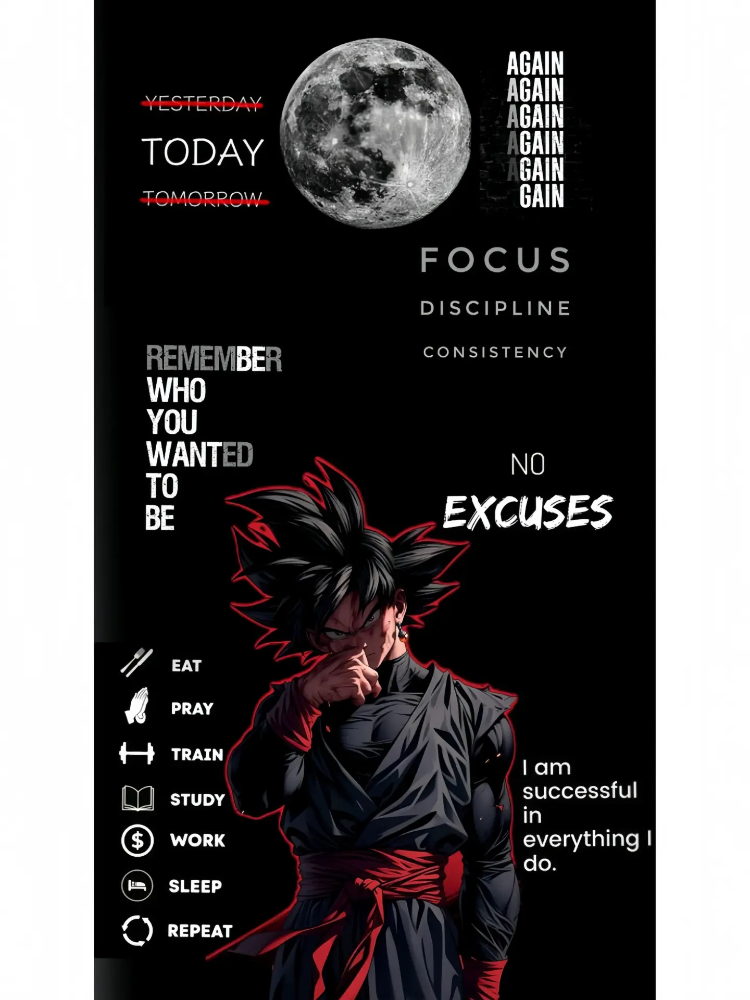

<div align="center">


<br/>

<p>
  
  &nbsp;
  
  &nbsp;
  
  &nbsp;
  
</p>

</div>

---

## 🧠 Who Am I?

```typescript
const harshit: Developer = {
  name:         "Harshit Gangwar",
  role:         "Full Stack Developer",
  location:     "India 🇮🇳",
  email:        "harshitgangwar1601@gmail.com",

  stack:        ["React", "Next.js", "Node.js", "TypeScript", "MongoDB", "PostgreSQL"],
  strengths:    ["Clean Code", "Scalable Architecture", "Problem Solving"],

  currentFocus: "Building production-grade full-stack applications",
  funFact:      "I debug with console.log and I'm not ashamed 😄",

  openTo:       ["Collaborations 🤝", "Open Source 🌐", "Freelance Projects 💼"],
};
```

> 💬 *"Code is not just instructions for a machine — it's a story written for the next developer."*

---

## 🌐 Let's Connect

<div align="center">

[](https://linkedin.com/in/harshit-gangwar-101ba5241)
[](https://www.leetcode.com/harshitgangwar1601)
[](mailto:harshitgangwar1601@gmail.com)
[](https://github.com/h1a2r3s4h)

</div>

---

## 🛠️ Tech Stack

<div align="center">

### 🎨 Frontend


### ⚙️ Backend & Database


### 🔧 Tools & DevOps


</div>

---
## 📊 GitHub Analytics

<div align="center">


</div>

<div align="center">


</div>
--

## 🧩 LeetCode Stats

<div align="center">


<br/><br/>

| 🟢 Easy | 🟡 Medium | 🔴 Hard | 🏅 Contests |
|:---:|:---:|:---:|:---:|
| Solved ✅ | Solved ✅ | Solved ✅ | Participated 🏆 |

📌 Full profile → [leetcode.com/harshitgangwar1601](https://leetcode.com/harshitgangwar1601)

</div>

---

## 🐍 Contribution Snake

<div align="center">

<picture>
  <source media="(prefers-color-scheme: dark)" srcset="https://raw.githubusercontent.com/h1a2r3s4h/h1a2r3s4h/output/github-contribution-grid-snake-dark.svg" />
  <source media="(prefers-color-scheme: light)" srcset="https://raw.githubusercontent.com/h1a2r3s4h/h1a2r3s4h/output/github-contribution-grid-snake.svg" />
  
</picture>

</div>

<details>
<summary>⚙️ <b>How to activate the Snake animation</b></summary>
<br/>

Create `.github/workflows/snake.yml` in your profile repo:

```yaml
name: Generate Snake

on:
  schedule:
    - cron: "0 */12 * * *"
  workflow_dispatch:

jobs:
  generate:
    runs-on: ubuntu-latest
    steps:
      - uses: Platane/snk@v3
        with:
          github_user_name: h1a2r3s4h
          outputs: |
            dist/github-contribution-grid-snake.svg
            dist/github-contribution-grid-snake-dark.svg?palette=github-dark
      - uses: crazy-max/ghaction-github-pages@v3
        with:
          target_branch: output
          build_dir: dist
        env:
          GITHUB_TOKEN: ${{ secrets.GITHUB_TOKEN }}
```

</details>

---

## 💡 Dev Quote of the Day

<div align="center">


</div>

---


<div align="center">
  
</div>

---


<div align="center">

### 🤝 Open to Collaborate — Let's Build Something Great!

[](https://www.buymeacoffee.com/)


</div>
